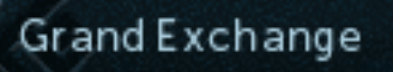

## Simba Tesseract

Tesseract is an open source text recognition (OCR) Engine.
https://github.com/tesseract-ocr/tesseract

Tesseract attempts to read any text providing the image is processed enough.

----

```pascal
function TTesseractOCR.Recognize(Area: TBox): String;
```

This method will capture the area of the target then process the image:

  - Resize:
      * Tesseract wants at least ~25 pixels height text. We can achieve this by scaling up the area.

  - Threshold:
      * Thresholding segments an image into a binary image which is which is an image that only contains two colors. 
        Assuming there is a large difference between the background and text color.

  This produces:

  

  

----

```pascal
function TTesseractOCR.Recognize(Image: TImage): String;
```

This method will do no processing of the image, however tesseract might still do some image processing internally.

----

### Basic example:

This includes provides a `TesseractOCR` variable to use.

```pascal
{$I SimbaTesseract/Tesseract.simba}

begin
  // Return the text in area 100,100,200,200
  WriteLn TesseractOCR.Recognize(TBox.Create(100,100,200,200));

  // Debug what was recognized above
  TesseractOCR.Debug();
end.
```

----

### Available methods:

```pascal
// Only match these characters
procedure TTesseractOCR.SetWhitelist(Value: String); 

// Do not match these characters
procedure TTesseractOCR.SetBlacklist(Value: String);

// Clear whitelist characters
procedure TTesseractOCR.ClearWhitelist;

// Clear blacklist characters
procedure TTesseractOCR.ClearBlacklist; 

// Drop characters with a match less than `Value`
procedure TTesseractOCR.SetMinMatch(Value: Single);

// OCR with resizing and threshold
function TTesseractOCR.Recognize(Area: TBox): String; overload;

// OCR on an image that has been processed by yourself
function TTesseractOCR.Recognize(Image: TImage): String; overload;

// Return the previous recognize bounds
function TTesseractOCR.GetTextBounds: TBox;

// Debug the previous recognize
procedure TTesseractOCR.Debug;

// Return all character matches of the previous recognize
function TTesseractOCR.GetCharacterMatches: TTesseractMatchArray;

// Return all word matches of the previous recognize
function TTesseractOCR.GetWordMatches: TTesseractMatchArray;

// Return all line matches of the previous recognize
function TTesseractOCR.GetLineMatches: TTesseractMatchArray;

// Return all block (paragraph) matches of the previous recognize
function TTesseractOCR.GetBlockMatches: TTesseractMatchArray; 
```